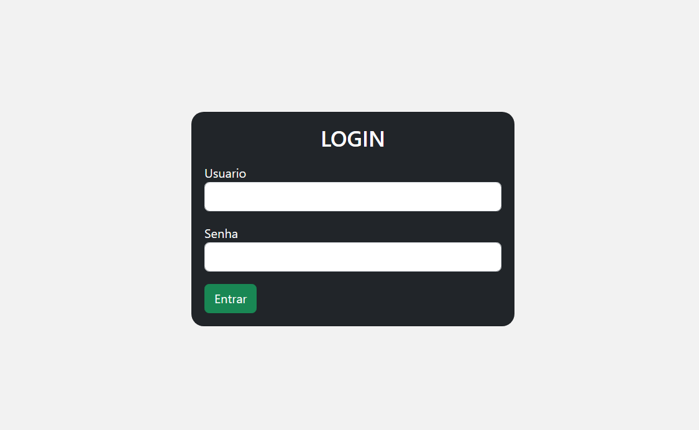

# Projeto de Tela de Login

## Descrição

Este projeto é uma tela de login básica e funcional. Ele contém campos para inserir o nome de usuário e a senha. Se o usuário tiver as credenciais corretas no banco de dados, o acesso é liberado e ele é redirecionado para uma página de dashboard.

## Tecnologias Utilizadas

- HTML
- Bootstrap
- CSS
- PHP

## Como Usar

1. Abra o arquivo `login.html` no seu navegador.
2. Insira seu nome de usuário e senha nos campos apropriados.
3. Clique em 'Entrar' para acessar o dashboard.

